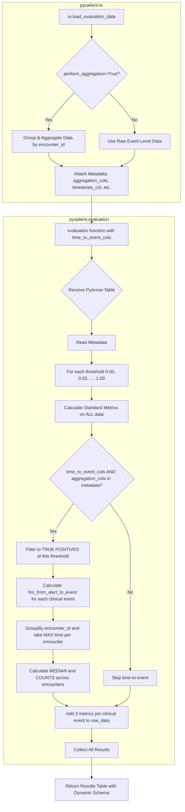

# Refactoring `pysalient/evaluation` for Time-to-Event Metrics

## 1. High-Level Goal

The primary objective is to refactor the `pysalient/evaluation` module to correctly calculate complex, grouped "median time to event" metrics, aligning with the logic demonstrated in the `6_model_evaluation.ipynb` notebook.

## 2. Architectural Principles

### Separation of Concerns: `io` vs. `evaluation`
The `pysalient` library follows a strict separation of concerns:
-   **`pysalient.io`**: This module is responsible for all data ingress and egress. It handles loading data from various sources and performs optional initial aggregations (e.g., grouping by an encounter ID). The aggregation column(s) used are stored in the table's schema metadata under the key `pysalient.io.aggregation_cols`.
-   **`pysalient.evaluation`**: This module consumes a prepared PyArrow Table from the `io` module. Its sole responsibility is to perform metric calculations. It reads metadata from the input table to inform its calculations.

### Internal Technology Stack

**`pysalient` Implementation Priority**:
1. **PyArrow** (primary) - For all table operations, schema metadata, and columnar data manipulation
2. **NumPy** (secondary) - For numerical computations, aggregations, and statistical operations
3. **Pandas** (boundary layer only) - For user-facing data export and interoperability

**Technology Contrast with Reference Implementation**:
- **`6_model_evaluation.ipynb`**: Uses PySpark + Pandas for data processing (suited for big data environments)
- **`pysalient`**: Uses PyArrow + NumPy for data processing (optimized for in-memory performance)
- **Future consideration**: PySpark adapter may be added later for big data scenarios

This approach prioritizes performance and memory efficiency for typical clinical evaluation datasets while maintaining compatibility with the reference notebook's algorithmic logic.

## 3. Key Discrepancies & The Core Problem

The central issue is that the `pysalient.evaluation` module currently lacks the capability to perform the specific, multi-step calculation required for the "median time to event" metrics.

### 3.1 Current vs Required Calculation Logic

-   **Standard Metrics** (e.g., Sensitivity, Specificity, TP, TN, FP, FN):
    -   Calculated for each threshold using the **entire dataset** provided
    -   Current implementation: ✅ **Correctly implemented**

-   **Time-to-Event Metrics** (e.g., `med_hrs_from_first_alert_to_bc`, `count_first_alerts_before_bc`):
    -   **Critical Finding**: These are **threshold-specific metrics**, not aggregate-level metrics
    -   Must be calculated **per threshold** using only **true positives** at that threshold
    -   Current implementation: ❌ **Missing entirely**

### 3.2 Reference Notebook Implementation Logic

**Note**: The `6_model_evaluation.ipynb` notebook uses **PySpark + Pandas** for its implementation. The `pysalient` library will implement the same algorithmic logic using **PyArrow + NumPy** for better in-memory performance.

Based on analysis of `6_model_evaluation.ipynb`, the correct workflow is:

1.  **Per-Threshold Loop**: For each threshold (e.g., 0.00, 0.02, 0.04, ..., 1.00):
    ```python
    # Notebook implementation (Pandas)
    for target_threshold in np.arange(0.00, 1.02, 0.02):
        df['y_pred'] = df[y_proba_col] >= target_threshold
    ```

2.  **True Positives Filter**: Filter to only true positives at this threshold:
    ```python
    # Notebook implementation (Pandas)
    df_tp = df[(df['y_pred']==1) & (df[y_test_col]==1)]
    ```

3.  **Time Difference Calculation**: Calculate hours from alert to clinical events:
    ```python
    # Notebook implementation (Pandas)
    df_tp['hrs_from_alert_to_bc'] = (df_tp['first_blood_cult_or_flag_dt'] - df_tp['EVENT_DT_TM']).dt.total_seconds() / 3600
    ```

4.  **Encounter-Level Aggregation**: Group by encounter ID and take max time per encounter:
    ```python
    # Notebook implementation (Pandas)
    df_enc = df_tp.groupby(['ENCNTR_ID']).max()
    ```

5.  **Median and Count Calculation**:
    ```python
    # Notebook implementation (Pandas)
    med_hrs_from_first_alert_to_bc = df_enc['hrs_from_alert_to_bc'].median()
    count_first_alerts_before_bc = df_enc[df_enc.hrs_from_alert_to_bc>0]['ENCNTR_ID'].nunique()
    count_first_alerts_after_or_at_bc = df_enc[df_enc.hrs_from_alert_to_bc<=0]['ENCNTR_ID'].nunique()
    ```

### 3.3 Current `pysalient/evaluation` Gaps

The current implementation is missing:

1.  **Multiple Clinical Event Columns**: No support for arbitrary clinical event timestamp columns
2.  **True Positive Filtering**: No logic to filter to true positives per threshold  
3.  **Encounter-Level Aggregation**: No groupby-max logic using encounter IDs
4.  **Time-to-Event Parameter**: No `time_to_event_cols` parameter in function signature
5.  **Dynamic Schema Generation**: Output schema is static, cannot accommodate variable time-to-event metrics
6.  **Metadata Reading**: No logic to read `pysalient.io.aggregation_cols` from metadata

### 3.4 Comparison with Current `timeseries_col` Implementation

Current `timeseries_col` functionality:
- Calculates "time to first alert" (when model first exceeds threshold)
- Uses **all data**, not just true positives
- Single column only
- Not encounter-aware

Required time-to-event functionality:
- Calculates "time from alert to clinical events" for true positives only  
- Multiple clinical event columns
- Encounter-aware (groupby encounter ID)
- Per-threshold calculation

## 4. Proposed Architecture & Design

The `evaluation` function will be enhanced to support time-to-event calculations, making it strictly conditional on the presence of aggregation metadata from the `io` module.

### 4.1 Function Signature Changes

-   **New `time_to_event_cols` parameter** (`dict[str, str] | None = None`):
    -   **Key**: Base name for the output metric (e.g., `'bc'` for blood culture metrics)
    -   **Value**: Column name in input data containing the clinical event timestamp (e.g., `'culture_event'`)
    -   **Auto-generates 3 metrics per key**: 
        - `{aggregation_func}_hrs_from_first_alert_to_{key}` (aggregated hours based on aggregation_func)
        - `count_first_alerts_before_{key}` (count of encounters with alerts before event)
        - `count_first_alerts_after_or_at_{key}` (count of encounters with alerts at/after event)

-   **New `aggregation_func` parameter** (`str = "median"`):
    -   **Purpose**: Specifies the aggregation function to apply across encounters for time-to-event metrics
    -   **Supported values**: `"median"`, `"mean"`, `"min"`, `"max"`, `"std"`, `"var"` (any NumPy aggregation function)
    -   **Default**: `"median"` (maintains compatibility with reference notebook implementation)
    -   **Example**: `aggregation_func="mean"` generates `mean_hrs_from_first_alert_to_bc` instead of `med_hrs_from_first_alert_to_bc`

### 4.2 Metadata Requirements

-   **Required metadata keys** for time-to-event calculation:
    -   `pysalient.io.aggregation_cols`: Encounter ID column(s) for grouping
    -   `pysalient.io.y_proba_col`: Probability column name  
    -   `pysalient.io.y_label_col`: Label column name
    -   `pysalient.io.timeseries_col`: Alert timestamp column (EVENT_DT_TM equivalent)

### 4.3 Conditional Calculation Logic

Time-to-event metrics are calculated **only if**:
1. `time_to_event_cols` parameter is provided (not None)
2. `pysalient.io.aggregation_cols` exists in metadata (indicating encounter-level data)
3. Required clinical event columns exist in the input table
### 4.4 Updated Workflow Diagram



## 5. Detailed Implementation Requirements

### 5.1 Function Signature Changes

**`evaluation()` function in `pysalient/evaluation/evaluation.py`:**
```python
def evaluation(
    data: pa.Table,
    modelid: str,
    filter_desc: str,
    thresholds: list[float] | tuple[float, ...] | tuple[float, float, float],
    timeseries_col: str | None = None,
    time_unit: str | None = None,
    time_to_event_cols: dict[str, str] | None = None,  # NEW PARAMETER
    aggregation_func: str = "median",  # NEW PARAMETER
    # ... existing parameters
) -> pa.Table:
```

### 5.2 New Metadata Keys to Read

In addition to existing metadata keys, read:
- `pysalient.io.aggregation_cols` (encounter ID column for grouping)
- Validate that `timeseries_col` from metadata contains alert timestamps

### 5.3 Output Schema Extension

**Current fixed schema**: 46 columns ending with F1_Score metrics
**Required dynamic schema**: Add 3 columns per `time_to_event_cols` key:
```python
# For time_to_event_cols = {'bc': 'culture_event', 'ab': 'antibiotics_event'} and aggregation_func = "median"
# Add these 6 columns:
pa.field("median_hrs_from_first_alert_to_bc", pa.float64()),
pa.field("count_first_alerts_before_bc", pa.int64()),  
pa.field("count_first_alerts_after_or_at_bc", pa.int64()),
pa.field("median_hrs_from_first_alert_to_ab", pa.float64()),
pa.field("count_first_alerts_before_ab", pa.int64()),
pa.field("count_first_alerts_after_or_at_ab", pa.int64()),

# For aggregation_func = "mean", columns would be:
# "mean_hrs_from_first_alert_to_bc", "mean_hrs_from_first_alert_to_ab", etc.
```

### 5.4 Core Algorithm Implementation

**Inside `_process_single_evaluation()` threshold loop:**

**`pysalient` Implementation (PyArrow + NumPy)**:
```python
# After calculating standard metrics (TP, TN, FP, FN, etc.)
if time_to_event_cols and aggregation_cols and len(true_positive_mask.sum()) > 0:
    
    # Filter to true positives at this threshold (NumPy equivalent)
    tp_mask = (predicted >= threshold) & (labels == 1)
    
    for event_key, event_col in time_to_event_cols.items():
        # Calculate time differences in hours for true positives (NumPy equivalent)
        tp_time_diffs = (event_timestamps[tp_mask] - alert_timestamps[tp_mask]) / 3600
        tp_encounter_ids = encounter_ids[tp_mask]
        
        # Group by encounter and take max time per encounter (NumPy equivalent)
        encounter_max_times = []
        for enc_id in np.unique(tp_encounter_ids):
            enc_mask = tp_encounter_ids == enc_id
            max_time = np.max(tp_time_diffs[enc_mask])
            encounter_max_times.append(max_time)
        
        encounter_max_times = np.array(encounter_max_times)
        
        # Calculate metrics (NumPy equivalent with flexible aggregation)
        agg_func = getattr(np, aggregation_func)  # Get NumPy function dynamically
        agg_time = agg_func(encounter_max_times)
        count_before = np.sum(encounter_max_times > 0)
        count_after_or_at = np.sum(encounter_max_times <= 0)
        
        # Add to row_data with dynamic column names
        row_data[f"{aggregation_func}_hrs_from_first_alert_to_{event_key}"] = agg_time
        row_data[f"count_first_alerts_before_{event_key}"] = count_before
        row_data[f"count_first_alerts_after_or_at_{event_key}"] = count_after_or_at
```

**Technology Translation Notes**:
- Pandas DataFrame operations → PyArrow Table + NumPy array operations
- `df.groupby().max()` → NumPy-based grouping with `np.unique()` and boolean indexing
- `df.median()` → `np.median()`
- Temporal operations leverage PyArrow's timestamp handling converted to NumPy arrays

### 5.5 Integration Points

1. **Metadata Reading**: Extend existing metadata extraction in `evaluation()` to read `aggregation_cols`
2. **Array Extraction**: Extract encounter ID and clinical event timestamp arrays alongside existing probability/label arrays  
3. **Dynamic Schema**: Replace fixed schema with dynamic schema generation based on `time_to_event_cols` keys
4. **Conditional Logic**: Wrap time-to-event calculation in proper conditions (metadata present + parameter provided)

### 5.6 Error Handling

Add validation for:
- `time_to_event_cols` values (column names) exist in input table
- `aggregation_cols` from metadata exists in input table  
- Clinical event timestamp columns have compatible data types
- `aggregation_func` is a valid NumPy aggregation function
- Sufficient true positives exist for meaningful calculation

**Valid aggregation functions**:
- Statistical functions: `"median"`, `"mean"`, `"std"`, `"var"`
- Extremes: `"min"`, `"max"`
- Quantiles: `"percentile_25"`, `"percentile_75"` (custom implementation required)
- Custom validation: Check if `hasattr(np, aggregation_func)` and function is callable

## 6. Testing Strategy and Test-Driven Development (TDD)

### 6.1 TDD Approach

**Implementation Order (Following TDD Red-Green-Refactor Cycle)**:
1. **Red**: Write failing tests for each requirement before implementation
2. **Green**: Implement minimal code to make tests pass
3. **Refactor**: Improve code structure while maintaining test coverage

**Test-First Requirements**:
- All new functionality must have corresponding failing tests written first
- Tests must cover both happy path and edge cases
- Integration tests must validate against reference notebook results
- Performance benchmarks must be established for regression testing

### 6.2 Unit Tests Required

**Basic Functionality Tests**:
1. **Backward compatibility**: Test with `time_to_event_cols=None` (should work as before)
2. **No aggregation metadata**: Test with `time_to_event_cols` provided but no aggregation metadata (should skip time-to-event)
3. **Parameter validation**: Test invalid `aggregation_func` values (should raise ValueError)

**Core Functionality Tests**:
4. **Single event with median**: Test with one clinical event and default `aggregation_func="median"`
5. **Multiple events**: Test with multiple clinical events in `time_to_event_cols`
6. **Different aggregation functions**: Test `"mean"`, `"min"`, `"max"`, `"std"` functions
7. **Dynamic schema generation**: Verify output schema matches `time_to_event_cols` and `aggregation_func`

**Edge Case Tests**:
8. **No true positives**: Test threshold where no true positives exist
9. **All alerts before events**: Test when all alerts occur before clinical events (all positive time diffs)
10. **All alerts after events**: Test when all alerts occur after clinical events (all negative time diffs)
11. **Missing clinical event columns**: Test when specified clinical event columns don't exist
12. **Invalid aggregation function**: Test with unsupported `aggregation_func` values
13. **Empty encounters**: Test when encounter grouping results in empty groups

**Data Type and Validation Tests**:
14. **Temporal data types**: Test with different timestamp formats (datetime64, timestamp)
15. **Missing values**: Test handling of NaT/NaN values in clinical event columns
16. **Column name edge cases**: Test with special characters, spaces in column names

### 6.3 Integration Tests Required

**End-to-End Pipeline Tests**:
1. **Full pipeline with aggregation**: `io.load_evaluation_data` with `perform_aggregation=True` → `evaluation` with `time_to_event_cols`
2. **Cross-technology validation**: Compare `pysalient` PyArrow+NumPy results against `6_model_evaluation.ipynb` PySpark+Pandas results for identical test cases
3. **Multiple clinical events integration**: Test full pipeline with complex `time_to_event_cols` dictionary
4. **Different aggregation functions integration**: Test pipeline with various `aggregation_func` values

**Reference Implementation Validation**:
5. **Notebook equivalency test**: Create test dataset matching notebook structure and validate identical results
6. **Performance comparison**: Benchmark PyArrow+NumPy vs reference Pandas implementation
7. **Memory usage validation**: Ensure PyArrow approach uses less memory than Pandas equivalent

### 6.4 Test Data Requirements

**Synthetic Test Datasets**:
1. **Minimal dataset**: 10 encounters, 50 events, 2 clinical event types
2. **Edge case dataset**: No true positives at certain thresholds, missing events
3. **Large dataset**: 1000+ encounters for performance testing
4. **Real-world structure**: Dataset matching actual clinical data patterns

**Required Test Data Columns**:
- `ENCNTR_ID`: Encounter identifiers  
- `EVENT_DT_TM`: Alert timestamps
- `y_prob`: Model probabilities (0.0-1.0)
- `sepsis3_flag`: Binary labels (0/1)
- `culture_event`: Clinical event timestamps (nullable)
- `antibiotics_event`: Clinical event timestamps (nullable)
- Additional clinical events for multi-event testing

### 6.5 Test Implementation Structure

**Test File Organization**:
```
tests/evaluation/
├── test_evaluation_time_to_event.py       # Core time-to-event functionality
├── test_evaluation_aggregation.py         # Aggregation function tests  
├── test_evaluation_integration.py         # End-to-end pipeline tests
├── test_evaluation_performance.py         # Performance benchmarks
└── fixtures/
    ├── synthetic_clinical_data.py          # Test data generators
    └── reference_notebook_data.py          # Notebook comparison data
```

## 7. Key Requirements from Reference Notebook Analysis

### 7.1 Current Hard-Coded Limitations (to be made flexible)

**Hard-coded clinical event columns in notebook**:
- `'first_blood_cult_or_flag_dt'` → User should specify as `'culture_event'`
- `'first_antibio_or_flag_dt'` → User should specify as `'antibiotics_event'`  
- `'first_clinical_susp_flag_dt'` → User should specify as `'clinical_suspicion_event'`
- `'first_sofa_flag_dt'` → User should specify as `'sofa_event'`
- `'first_sepsis3_flag_dt'` → User should specify as `'sepsis3_event'`

**Hard-coded aggregation function**:
- Notebook uses `.median()` exclusively for time-to-event calculations
- New requirement: Make aggregation function user-configurable

**Hard-coded encounter grouping**:
- Notebook uses `'ENCNTR_ID'` column for grouping
- pySALIENT: Read from metadata `pysalient.io.aggregation_cols`

### 7.2 User Interface Design Requirements

**Flexible Column Specification**:
```python
# User specifies their actual column names, not hard-coded notebook names
time_to_event_cols = {
    'bc': 'culture_event',           # Instead of 'first_blood_cult_or_flag_dt'  
    'ab': 'antibiotics_event',       # Instead of 'first_antibio_or_flag_dt'
    'cs': 'clinical_suspicion_event', # Instead of 'first_clinical_susp_flag_dt'
    'sofa': 'sofa_event'             # Instead of 'first_sofa_flag_dt'
}

# User can specify aggregation function
aggregation_func = "mean"  # Instead of hard-coded "median"
```

**Flexible Output Column Generation**:
```python
# Generated columns based on user inputs:
# For aggregation_func="median" and event_key="bc":
"median_hrs_from_first_alert_to_bc"
"count_first_alerts_before_bc" 
"count_first_alerts_after_or_at_bc"

# For aggregation_func="mean" and event_key="bc":
"mean_hrs_from_first_alert_to_bc"
"count_first_alerts_before_bc"
"count_first_alerts_after_or_at_bc"
```

### 7.3 Backward Compatibility Requirements

**Default Behavior (if not specified)**:
- `time_to_event_cols=None`: Skip time-to-event calculations entirely
- `aggregation_func="median"`: Maintain compatibility with notebook results

**Progressive Enhancement**:
- Existing evaluation functionality must remain unchanged
- New parameters are optional and additive
- No breaking changes to current API

### 7.4 Reference Implementation Compliance

**Algorithmic Equivalence Requirements**:
1. **Identical threshold processing**: Same threshold loop (0.00, 0.02, ..., 1.00)
2. **Identical true positive filtering**: `(predicted >= threshold) & (labels == 1)`
3. **Identical time calculation**: `(event_timestamp - alert_timestamp) / 3600` (hours)
4. **Identical encounter aggregation**: Group by encounter, take max time per encounter
5. **Identical final aggregation**: Apply aggregation function across encounters
6. **Identical count logic**: Count encounters with positive/negative time differences

**Result Validation**:
- For identical inputs with `aggregation_func="median"`, results must match notebook output exactly
- Floating-point precision: Results must match within 1e-10 tolerance
- Integer counts: Must match exactly

## 8. Documentation Requirements

### 8.1 Documentation Updates Required

**Sphinx Documentation (`docs/` directory)**:
The project uses Sphinx for documentation generation. The following documentation files must be updated during implementation:

**API Documentation (`docs/source/api.rst`)**:
- Add comprehensive documentation for new `evaluation()` parameters:
  - `time_to_event_cols`: Dict parameter with examples and use cases
  - `aggregation_func`: String parameter with supported function list
- Document new output schema fields with dynamic column naming
- Provide clear migration guide from hard-coded to flexible approach

**User Guide Documentation**:
- **New tutorial section**: "Time-to-Event Metrics Evaluation"
- **Code examples**: Complete workflow from data loading to evaluation
- **Parameter configuration guide**: How to specify clinical event columns
- **Aggregation function guide**: When to use median vs mean vs other functions
- **Troubleshooting section**: Common issues and solutions

**Examples and Use Cases**:
- **Clinical use case examples**: Blood culture, antibiotic administration, SOFA scores
- **Comparison examples**: Before/after using flexible vs hard-coded approach
- **Performance examples**: Memory and speed improvements over reference implementation

### 8.2 Documentation Implementation Timeline

**Phase 1 (Parallel with Core Implementation)**:
1. **API documentation**: Update `api.rst` with new parameter specifications
2. **Docstring updates**: Comprehensive docstrings for all new functionality
3. **Type hints documentation**: Clear parameter and return type documentation

**Phase 2 (Integration Phase)**:
4. **Tutorial creation**: Step-by-step guide for time-to-event analysis
5. **Example notebooks**: Jupyter notebooks demonstrating real-world usage
6. **Migration guide**: How to transition from notebook to pySALIENT implementation

**Phase 3 (Post-Implementation)**:
7. **Performance documentation**: Benchmarks and optimization recommendations
8. **Best practices guide**: Clinical evaluation methodology recommendations
9. **FAQ section**: Common questions and edge case handling

### 8.3 Documentation Standards and Requirements

**Consistency Requirements**:
- Follow existing pySALIENT documentation style and formatting
- Maintain consistency with current API documentation patterns
- Use same terminology and naming conventions throughout

**Technical Requirements**:
- All new parameters must have detailed type hints and examples
- Code examples must be tested and functional
- Cross-references between related functionality must be maintained
- Documentation must build successfully with Sphinx

**User Experience Requirements**:
- Clear, jargon-free explanations for clinical users
- Progressive complexity (basic → advanced usage)
- Visual examples and diagrams where helpful
- Practical, real-world examples over toy datasets

### 8.4 Documentation Test Requirements

**Documentation Testing**:
- All code examples in documentation must be tested via doctest
- Documentation build must pass without warnings or errors
- Links and cross-references must be validated
- Examples must use realistic clinical data patterns

## 9. Technology Implementation Notes

**Future Considerations**:
- **PySpark adapter**: May be added to `pysalient/adapters/` for big data environments
- **Performance benchmarking**: PyArrow+NumPy vs PySpark+Pandas for various data sizes
- **Memory profiling**: Ensure PyArrow approach scales appropriately

The `pysalient` implementation prioritizes in-memory performance while maintaining algorithmic compatibility with the reference notebook implementation.
